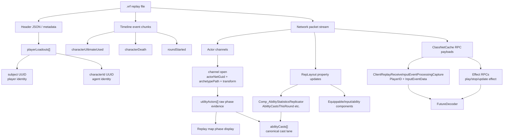
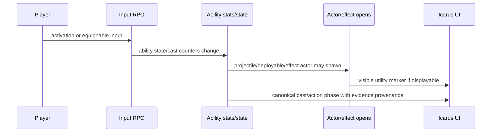

# Replay Ability Event Shape

This note is a shared mental model for the current VALORANT replay decoder.
The short version: an ability use is not one clean object in the replay. One
button press can appear as input RPC bytes, replicated ability stats, one or
more actor channel opens, effect RPCs, timeline events, or sometimes no
displayable actor at all.

## Identifier Layers

| Identifier | Example | Scope | Current meaning |
| --- | --- | --- | --- |
| Replay id UUID | `ff96dfb2-e766-40db-affb-a3af36a07b83` | Global-ish replay file | The `.vrf` identity/name, not an ability. |
| Player subject UUID | `3cc266ac-3b53-5e1a-a15c-209642187b7b` | Match/player metadata | Player account identity from header loadouts. |
| Character UUID | `add6443a-41bd-e414-f6ad-e58d267f4e95` | VALORANT content metadata | Agent identity, for example Jett. |
| Unreal NetGUID | `actorNetGuid: 1234`, `repObject: 9` | Replay-local | Runtime object/actor identity. Not stable across replays. |
| Channel index | `chIndex: 77` | Replay packet stream | Network channel carrying an actor or component. Reused over time. |
| Archetype path | `Default__Ability_Wushu_Q_CycloneBoost_C` | Cooked Unreal content path | Best current ability artifact identity. Usually gives agent codename and slot token. |
| Class name | `Ability_Wushu_Q_CycloneBoost` | Derived from archetype path | UI-friendly shorthand for artifact type. |
| Ability slot | `Ability1`, `Ability2`, `Ultimate` | Stable network/static catalog | Exact static ability identity maps the replay artifact to its `EAresItemSlot`; token rules remain diagnostics only. |
| Input PlayerID | `PlayerID` in `ClientReplayReceiveInputEventProcessingCapture` | Replay RPC payload | Observed `0x100..0x109` IDs join exactly to header loadout/player identity. |

## Current Answer On Ability UUIDs

We do find UUIDs in the replay diagnostics, but the UUIDs currently found are
replay/player/agent metadata. The current `utilityActors[]` ability records do
not carry a per-ability UUID.

The local `VALORANT_12.11_zs.usmap` schema exposes stable content GUIDs on
content assets, but the obvious replay ability-use surfaces are not clean
"ability cast UUID" fields:

- `AresBasePrimaryDataAsset.Uuid` is the likely stable content UUID layer for
  exported game data.
- Match/header player structures expose `CharacterID`/`CharacterId` as GUIDs
  or strings. These identify agents, not individual ability uses.
- `AresInputEventReplayCapture` contains only `SerializedInputEventData`,
  `NumBits`, and `EventProcessingResult`. The actual input event is a nested
  byte/bit payload, not a decoded UUID-bearing object.
- `AresEquippable` has GUID fields for skin/chroma/charm/attachment assets.
  Those identify cosmetics/equippable assets, not an ability cast.
- Ability actor/channel records currently expose replay-local NetGUIDs and
  Unreal paths, not stable content UUIDs.

So the practical identity key today is:

```text
ability artifact instance = replay-local actorNetGuid/chIndex
ability artifact type     = archetypePath/className
ability family            = static agent + network abilitySlot
agent content identity    = header playerLoadout.characterId UUID
ability state             = replay CurrentState NetGUID -> exported state path
```

If we want a content-level ability key, the likely join is not "read UUID from
each replay event." It is more like:

```text
className/archetypePath -> agent codename + slot -> content catalog entry
```

That catalog can be built from exported game data or a curated mapping. The
replay can then emit `contentAbilityKey` or `agentCharacterId + abilitySlot`,
even when the raw packet did not include a UUID.

## Local 12.11 Content Catalog

The local FModel install points at:

```text
E:\Games\Riot Games\VALORANT\live\ShooterGame\Content\Paks
```

The newest local mapping file used for this pass is:

```text
C:\Users\shawn\Downloads\VALORANT_12.11_zs.usmap
```

Run the local package-index catalog with:

```powershell
npm --prefix tools\valorant_replay_probe run catalog-valorant-content-assets -- --track ".\tmp\ff96dfb2.current_after.native_component.track.json" --out ".\tmp\valorant_12_11_content_ability_catalog.json"
```

Current catalog summary:

| Layer | Count | Notes |
| --- | ---: | --- |
| Core ability-shaped content assets | 542 | Excludes noisy `FXC_*` visual-effect assets by default. |
| `Ability_*` classes | 178 | The cleanest developer-authored ability class vocabulary. |
| `GameObject_*` classes | 163 | Deployables, landed effects, and spawned game objects. |
| `Projectile_*` classes | 128 | Projectile/effect carrier classes. |
| `Equippable_*` classes | 29 | Includes weapon/equippable classes; not all are ability uses. |
| Ability/component/schema/action assets | 44 | `Comp_Ability*`, `CharacterAbility*`, input action/enums, and one damage source. |
| Current replay class names matched to catalog | 52 / 57 | Most actor classes seen by the replay probe are real VALORANT content classes. |

The five unmatched current replay class names are:

```text
ChildActor_GEN_VARIABLE_GameObject_Sequoia_X_ArenaCover_C_CAT
Cover2_GEN_VARIABLE_GameObject_Sequoia_X_ArenaCover_C_CAT
Cover3_GEN_VARIABLE_GameObject_Sequoia_X_ArenaCover_C_CAT
EquippablePickupProjectile
Pawn_Killjoy_E_Turret
```

This is important: catalog membership proves the actor/class is a real content
artifact, but it still does not prove a player used an ability at that timestamp.
Generated child actors, pawns, pickup projectiles, initial replication, and
stateful deployables all need separate treatment.

## Current Sample Counts

From `ff96dfb2-e766-40db-affb-a3af36a07b83.vrf` after the current decoder pass:

| Layer | Count | Notes |
| --- | ---: | --- |
| Header player loadouts | 10 | Contains player `subject` UUID and agent `characterId` UUID. |
| Unique UUIDs in diagnostics | 20 | Replay id, 10 player subjects, 9 unique character IDs because two players are Sova. |
| Raw `utilityActors[]` | 92 | Actor channel opens that look ability/utility related. |
| Old mention-only ability count | 92 | This was overcounting raw actor evidence. |
| New displayable ability candidates | 26 | Requires non-ignored display lifetime. |
| Initial null-lifetime actor opens | 57 | Mostly setup/initial replication, not casts. |
| `EquippablePickupProjectile` | 9 | Weapon/equippable pickup/drop noise. Ignored for ability UI. |
| Timeline `characterUltimateUsed` | 35 | Proven event group exists, but not enough alone for full ability visualization. |
| Ability signal samples | 5000 capped | Mixed replicated layout and class-net/RPC payload breadcrumbs. |
| Dedicated ability cast signal samples | 466 | Full `AbilityCastsThisRound` captures across the replay, not limited by the mixed signal bucket. |
| Input event capture samples | 2000 capped | `ClientReplayReceiveInputEventProcessingCapture` samples. |
| Core local content catalog | 542 | Developer-authored ability-shaped class/schema/action names from local 12.11 package indexes. |

The "starts around 66" UI symptom matches the current raw timeline shape. In
the sample track, `utilityActors[0..56]` are all `64ms` actor/class opens with
`lifetimeMs: null`, then seven early `EquippablePickupProjectile` noise entries
appear before the first displayable marker:

```text
raw 1..57: 64ms ability/equippable class opens, null lifetime
raw 58..64: EquippablePickupProjectile, ignored
raw 65: 111700ms Pawn_Killjoy_E_Turret
raw 66: 111700ms Ability_Killjoy_E_TurretAttack
```

So that number is not evidence of the 66th true cast. It is a raw evidence-list
index leaking into the reviewer experience.

## Shape Diagram



## Evidence Layers

### 1. Timeline Events

These are the cleanest "real event happened" signals, but they are sparse.
In the current sample we see:

```json
{
  "roundStarted": 22,
  "characterDeath": 156,
  "spikePlanted": 12,
  "characterUltimateUsed": 35,
  "switchTeams": 1
}
```

`characterUltimateUsed` is strong evidence that an ultimate was used, but it
does not replace the need to decode normal ability activations.

### 2. Utility Actor Opens

These are concrete replay artifacts with transforms:

```json
{
  "timeMs": 640891,
  "actorNetGuid": 1234,
  "chIndex": 77,
  "archetypePath": "Default__Ability_Wushu_Q_CycloneBoost_C",
  "className": "Ability_Wushu_Q_CycloneBoost",
  "agent": "Jett",
  "abilitySlot": "Ability1",
  "position": { "x": 1382.2, "y": -10417.9, "z": 400.3 }
}
```

This is not guaranteed to mean "button pressed at this moment." It means an
ability-related actor/class appeared on a channel. That can represent setup,
projectile spawn, deployable spawn, landed effect, passive, or an initial
replication snapshot.

### 3. Ignored Noise

`EquippablePickupProjectile` currently looks like weapon/equippable pickup or
drop behavior. It has an actor open and close, but is not a Valorant ability use:

```json
{
  "className": "EquippablePickupProjectile",
  "lifetimeMs": null,
  "observedLifetimeMs": 634,
  "durationSource": "ignored-non-ability-projectile",
  "ignoredAsAbility": true
}
```

### 4. Ability Signal Samples

The raw samples remain decoding breadcrumbs, while proven fields are emitted
into app-facing cast/action rows:

```json
{
  "source": "rep-layout",
  "actorGroup": "/Game/Characters/_Core/Comp_AbilityStatisticsReplicator.Comp_AbilityStatisticsReplicator_C",
  "repObjectPath": "Comp_AbilityStatisticsReplicator",
  "fieldName": "AbilityCastsThisRound",
  "payloadHex": "..."
}
```

This layer is now the canonical cast lane. The decoder extracts the UUID-like
`Player` string, raw `EAresItemSlot` byte, conservative ability-slot mapping,
replay round, `EAresGamePhase`, `CastTime`, cast location, effect locations,
destroyed count, and `CharacterAbilityEffectInfo[]` from
dedicated `AbilityCastsThisRound` samples. The local replay schema verifies the
slot enum bridge as `3=Grenade`, `4=Ability1`, `5=Ability2`, `6=Passive`, and
`9=Ultimate`; passive rows are not promoted as cast/use rows.

Current sample result from
`tmp\ff96dfb2.cast_lane_enum_fix.native_component.track.json`:

| Field | Count |
| --- | ---: |
| `abilityCasts[]` | 127 |
| `abilityCasts[abilitySlot=Ultimate]` | 10 |
| `utilityActors[]` | 92 |
| `utilityActors[contentKind=pickup-drop]` | 9 |
| `utilityActors[contentKind=pawn-deployable]` | 1 |
| `utilityActors[sourceCastId != null]` | 9 |
| `abilityCasts[linkedUtilityActorIds not empty]` | 7 |

The cast lane was previously undercounted because `AbilityCastsThisRound` shared
the 5000-row mixed ability-signal bucket with input/equippable/effect noise; that
bucket filled by ~73s. `AbilityCastsThisRound` now has a dedicated capture lane.
Same-agent/slot/time-window joins are retained only as
`candidateSourceCastId`; they cannot set causal `sourceCastId`, owner, suppress a
cast marker, or merge canonical actions. `sourceCastId` is reserved for the
decoded `FocusProjectiles` actor-NetGUID reference path.

### 5. Input Capture RPC

This comes from the reference parser/usmap trail and is now decoded into a
deduplicated non-movement lane:

```json
{
  "functionName": "ClientReplayReceiveInputEventProcessingCapture",
  "fields": [
    { "name": "PlayerID", "payloadHex": "04010000" },
    { "name": "InputEventData", "payloadHex": "18040001" }
  ]
}
```

The 12.11 schema names this payload as `AresInputEventReplayCapture`:

```text
SerializedInputEventData: byte[]
NumBits: UInt32
EventProcessingResult: Byte
```

The related enums are useful anchors:

```text
EInputEventType:
  0 EquippableInput
  1 ActivationInput
  3 MovementInput
  4 EquippableChange
  8 EquippableDrop
  10 InteractInput

EAresEquippableInput:
  0 Primary_Trigger
  1 Secondary_Trigger
  5 UseAgentAbility
  6 Drop
  7 Activate
```

The first byte is Unreal's packed nested bit count. The next bytes contain the
serialized event; its low nibble is `EInputEventType`; the byte after the
serialized payload is `EventProcessingResult`. `PlayerID` is little-endian and
the observed `0x100..0x109` range maps mechanically to header loadout indices
`0..9`. Native tracks now emit these facts as `inputEvents[]`:

```text
time -> replay player -> input kind -> raw typed payload -> processing result
```

For `EquippableChange`, the bits after the type nibble are an Unreal-packed
equippable NetGUID. An exact join to a replay-opened, static-identified ability
equippable for the same player/agent now emits `equippableNetGuid`,
`canonicalAbilityId`, and an observed `equip-selected` phase. This recovers
equip evidence for abilities that `AbilityCastsThisRound` omits without using a
time window. Activation, trigger, and primary/secondary input payloads are still
unassigned until their remaining bits are proven.

Current sample anchors:

| Field | Observed shape |
| --- | --- |
| `PlayerID` | Ten decoded little-endian values: `256..265`. |
| `InputEventData` | Variable length: 24, 32, 40, or 64 bits in the capped samples. |
| Most common data payload | `18040001` appears 668 times. |
| Common shorter payloads | `0c0300`, `0c1300`. |
| Common 32-bit family | `1e010000`, `1e210000`, `1e410000`, ... |
| Common 40-bit family | Payloads beginning with `28...`. |

### 6. Equippable State Machine

`EquippableStateMachineComponent.CurrentState` is a replay property whose
payload is an Unreal-packed NetGUID. Resolving that GUID through the replay's
runtime export map produces the semantic state name instead of guessing it
from timing. Native tracks emit these as `abilityStateEvents[]` and group each
non-initial active sequence through its observed return to `InactiveState`:

```text
exact ability equippable NetGUID
  -> CurrentState NetGUID
  -> exported state path/name
  -> observed canonical action phase
```

Observed examples include `LineTargetingTripWireStateComponent`,
`MapTargetingState`, `RespondToEventState_StartCharge`,
`RespondToEventState_Throw`, `StateComponent_WaitForSpawnedCharacterToBePossessed`,
`State_Dashing`, `ApplyForceModuleState`, `CorpseTargetingStateComponent`, and
Clove's post-death/resurrection states. Initial replication is retained but is
not treated as a fresh ability action. An exact input/equippable NetGUID join
can also provide the player owner; otherwise ownership remains unknown.

### 7. Named Ability-Actor RPCs

Class-net RPC fields on exact static-identified ability actors are emitted as
`abilityRpcEvents[]`. The current lane includes `MulticastStopProjectile`,
continuous-effect play/update/stop, `MulticastPlayOneShotEffect`,
`ClientResetStateMachine`, and `MulticastOnItemMovedToPersistentData`. An exact
actor-NetGUID match attaches the RPC to the corresponding utility action. These
are observed engine events, but their interpretation remains deliberately
narrow: they are useful trigger, pulse, projectile-transition, and reset
evidence, not automatic proof of hit, destruction, recall, or natural expiry.

## How To Think About A Single Ability Use

One player action can fan out like this:



Important consequences:

- Some abilities produce multiple actor records for one use.
- Some abilities produce no useful actor record, especially instant or stateful
  abilities.
- Some actor records are not uses at all, especially initial replication and
  pickup/drop projectiles.
- Stable identity is `valorant.<agent>.<network-slot>`, backed by character
  UIData and exported source/spawn identities. Static identity does not claim
  replay lifecycle observation.

## Next Decoder Targets

1. Decode the remaining per-type input payload after `EInputEventType`,
   especially activation and primary/secondary press/release semantics; exact
   `EquippableChange` NetGUID identity is already decoded.
2. Decode direct actor owner/instigator/source-ability NetGUIDs so actor phases
   no longer need cast-time linkage.
3. Decode actor/gameplay-effect activation, trigger, recall/pickup,
   destruction, owner death, suppression, charge/ammo, and player-buff state.
   Equippable targeting/charge/throw/dash/possess transitions are now decoded,
   but they do not by themselves prove the spawned actor's semantic outcome.
4. Decode semantic termination cause. Actor channel close proves observation
   ended; it does not by itself distinguish expiry, recall, destruction, or
   dormancy.
