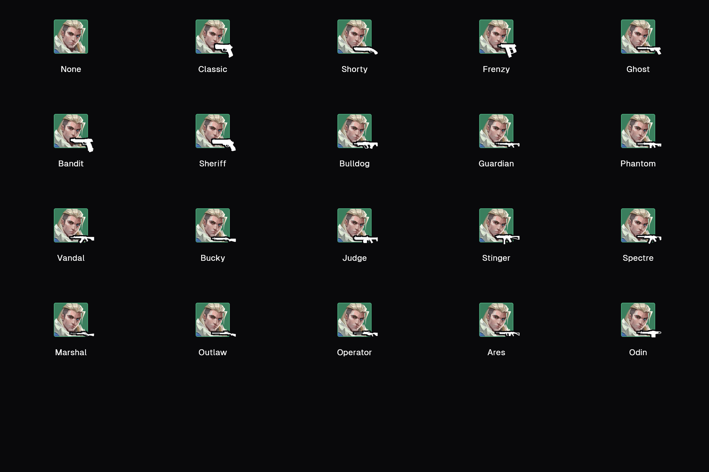
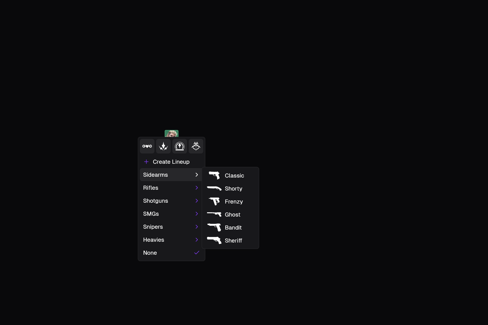

# Agent firearm verification

Windows captures from commit `9a1c96ddc7416f5ce4f1cc29ad45113a67455126`, taken on 2026-09-13. The native test app uses in-memory providers and never opens a user's library.

Run from PowerShell:

```powershell
$env:ICARUS_WEAPON_TEST_ARTIFACT_DIR = "$PWD/firearm-captures"
flutter test integration_test/agent_weapon_test.dart -d windows
```

All 11 scenarios passed. [The native output](windows-test-output.txt) includes `gun overhang paints outside the portrait and has no hit target`. That scenario checks the badge bounds, moves and right-clicks outside the portrait, then requires actual white pixels outside the portrait in the rendered image. The pixel assertion is unconditional.

The screenshots below were also inspected visually. Every gun is visible at the portrait's bottom-right, and all portraits keep the same dimensions. The white silhouette has a dark outline for contrast against the portrait.





The Windows CI run also passed all 493 unit/widget tests, including the overhang pixel assertion, with one existing skipped test: [CI run](https://github.com/SunkenInTime/icarus/actions/runs/34738623168).

## Isolated pixel check

Greptile's first review exposed a test timing issue. Running only the overhang test started with a cold image cache and captured before the firearm asset decoded. The full suite had already loaded it during the menu scenarios. The test now awaits `precacheImage` before inspecting pixels. This isolated command reproduces the original failure before that fix and passes after it:

```powershell
flutter test test/agent_weapon_widgets_test.dart --plain-name 'gun overhang paints outside the portrait and has no hit target'
```
